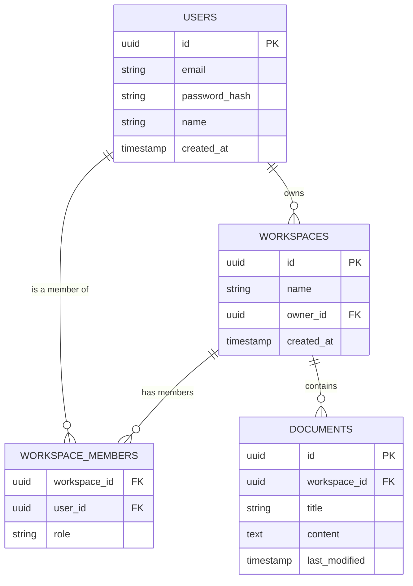

# Database Entity-Relationship Diagram (ERD)

## Overview

This schema manages the relational data for users, their workspaces, and the documents contained within those workspaces. It is implemented using PostgreSQL as the database and Spring Data JPA with Hibernate for persistence and object-relational mapping.

## Entity-Relationship Diagram (Mermaid.js)

## Entity Descriptions

- `USERS`: Stores application users, including authentication data, display name, and account creation metadata.
- `WORKSPACES`: Represents a collaborative space owned by a user and acts as the top-level grouping for members and documents.
- `WORKSPACE_MEMBERS`: Supports role-based access control by linking users to workspaces and assigning roles such as `ADMIN`, `EDITOR`, or `VIEWER`.
- `DOCUMENTS`: Stores collaborative document data, including the title, content, and last modification timestamp for each workspace.
