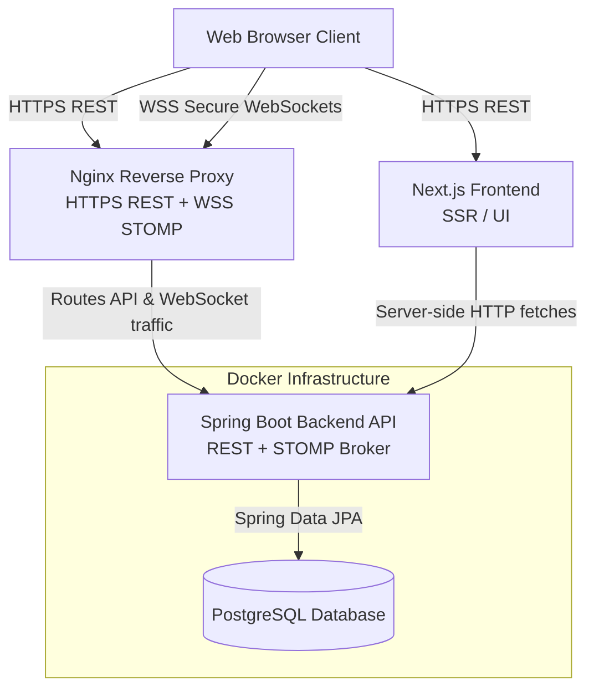

# System Architecture Design

## Architecture Overview

The application follows a decoupled, layered architecture in which the frontend is built with Next.js and renders pages using server-side rendering, while the backend is implemented in Spring Boot and exposes RESTful APIs for application logic and collaboration services. The system persists relational data in PostgreSQL, with Docker used to containerize the backend and database services and Nginx handling inbound traffic and reverse proxy routing.

## System Architecture Diagram (Mermaid.js)

## Component Descriptions

### Frontend (Next.js)

- Renders the user interface using server-side rendering to improve performance and initial load behavior.
- Manages client-side application state for UI interaction and workspace navigation.
- Establishes STOMP/WebSocket connections to receive live collaboration updates and publish local edits.

### Backend (Spring Boot)

- Implements business logic for user authentication, workspace management, and document operations.
- Exposes REST API endpoints for CRUD operations and application workflows.
- Handles JWT-based authentication for securing protected resources.
- Provides STOMP message brokering for real-time collaborative updates and event distribution.

### Database (PostgreSQL)

- Stores persistent relational data for users, workspaces, workspace memberships, and document content.
- Maintains authoritative state for collaborative operations and system records.
- Integrates with Spring Data JPA and Hibernate for data persistence and ORM-based access.

### Infrastructure (Docker & Nginx)

- Containerizes the backend application and PostgreSQL database for portability and environment consistency.
- Uses Nginx as a reverse proxy to route HTTPS traffic to the application and terminate SSL where configured.
- Supports both REST API traffic and secure WebSocket traffic for real-time collaboration features.
